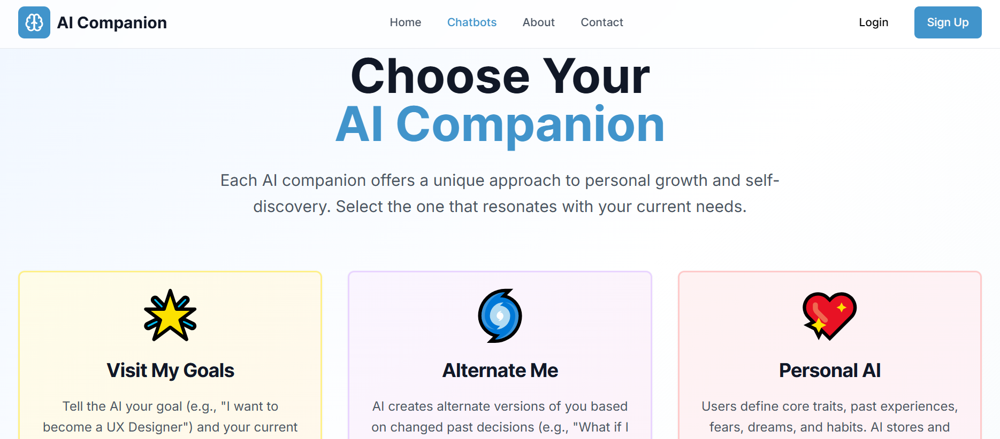
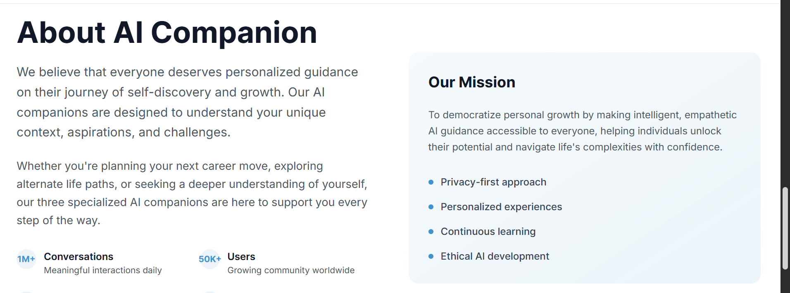

# 🧠 PersonaFlow: Your AI Companion for Self-Growth

> **Talk, reflect, and grow with an AI that truly listens.**

**PersonaFlow** is a 3-in-1 emotionally intelligent chatbot system designed to guide users through personal growth, goal setting, self-discovery, and emotional expression. Inspired by journaling, digital wellness, and human connection, it offers a calming space where your thoughts are heard and reflected on—like a digital twin that evolves with you.

---

## 📸 Website Preview

  
  
<em>🔵 PersonaFlow Home Interface</em>

  

  

> 📁 *Place your images inside the `/screenshots` folder and update file names if needed.*

---

## 🌟 Chatbot Overview

### 🎯 Visit My Goals – *Dream It. Plan It. Do It.*
A goal-setting mentor that helps you define personal or professional goals, break them into achievable steps, track progress, and stay motivated. It makes planning feel empowering, not overwhelming.

### 🧍 Alternate Me – *Discover the Layers of You*
A reflection companion that helps you explore your personality, past experiences, and future identity. It’s a thoughtful space for journaling, introspection, and personal growth.

### 🤖 Personal AI – *A Thoughtful Listener for Your Emotions*
Your emotionally aware assistant that detects your mood and offers empathetic responses, calming suggestions, or motivational boosts. When you need a moment to process or feel heard, it’s there.

---

## 🔧 Technologies Used

| Technology              | Role                                              |
|------------------------|---------------------------------------------------|
| Python                 | Core logic and chatbot orchestration              |
| Gradio                 | Interactive user interface                        |
| Hugging Face Transformers | Emotion detection using `nateraw/bert-emotion`     |
| Google Gemini Pro API  | Generative conversational responses               |
| JSON                   | Persistent user profile and memory management     |
| Google Colab (optional)| Cloud-based development and testing               |

### visit our website https://v0-activate-senior-mode.vercel.app/
